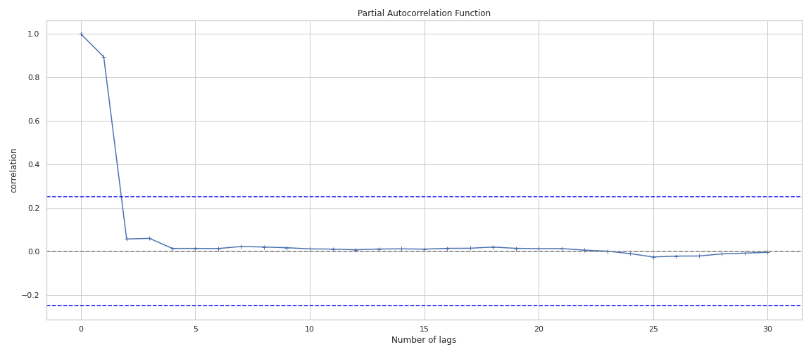

# Beijing-air-quality-prediction-internship

## Project Introduction
### 1. Introduction
This project has applied  Machine Learning and Deep Learning techniques to analyse and predict the Air Quality in Beijing. Our task is to predict one hour into the future the concentration level of air pollutant **PM2.5**.

For the machine learning part we used a lag of 2 hours, which we deducted using **PACF**.
But when in came to Deep learning we opted for a 48h lag because longer sequences gives better predictions.

### 2. Data
This data set includes hourly air pollutants data from 12 nationally-controlled air-quality monitoring sites. The air-quality data are from the Beijing Municipal Environmental Monitoring Center. The meteorological data in each air-quality site are matched with the nearest weather station from the China Meteorological Administration. The time period is from March 1st, 2013 to February 28th, 2017. Missing data are denoted as NA. [Link of the dataset](https://archive.ics.uci.edu/ml/datasets/Beijing+Multi-Site+Air-Quality+Data?fbclid=IwAR0SfBi3p0RYjQBL3Vh1QCDFdAkPP5VTj_JhMqQkIteHk-O1q4bjQYw7mOQ)

  **NW :**
- We merged this data into one CSV.
- Outlier detection and removal using box plot.
- KNNImputation to impute missing values.
- The link to this preporcessed data can be found here [Link of the dataset](https://www.kaggle.com/datasets/medali1992/beijing-air-quality-preprocessed)

### 3. PACF
We used this function to determine the appropriate lags **p** in an AR **(p)** model or in an extended ARIMA **(p,d,q)** model.
We choose for example the explanatory variable `PM10` and how it is correlated in time.
We noticed that all variable verify the same plot meaning the best lag is two.

### 4. Souce Code
The main project implementation files can be seen in the directory named **'src'**. The structure and description of this directory is shown as:
- src:
    - AirQualityData:
        - The preprocessed data.
    - DataPreprocessing.ipynb
        - The notebook mainly for data cleaning and data preprocessing.
    - Deep Learning
        - Pytorch LSTM Baseline .ipynb
        - Pytorch Attention LSTM Baseline.ipynb
        - Tabnet baseline.ipynb

    - Machine Learning
        - Catboost baseline.ipynb
        - Lightgbm-baseline.ipynb
        - Linear models baseline.ipynb
        - XGBOOST-Baseline.ipynb
    
### 6. Benchmark

| Model | RMSE | Kaggle | code | 
|:---|:---|:---|:---| 
| Catboost | 0.925(08) | [our work](https://www.kaggle.com/code/nourhadrich/catboost-baseline) | [this repo](https://github.com/helme/ecg_ptbxl_benchmarking/)| 
| Lightgbm | 0.925(07) | [our work](https://www.kaggle.com/code/khalil20cherif/linear-models-baseline) | [this repo](https://github.com/helme/ecg_ptbxl_benchmarking/)| 
| XGBOOST | 0.919(08) | [our work]() | [this repo](https://github.com/helme/ecg_ptbxl_|
| Linear models | 0.925(08) | [our work](https://www.kaggle.com/code/khalil20cherif/linear-models-baseline) | [this repo](https://github.com/helme/ecg_ptbxl_benchmarking/)| 
| LSTM | 0.925(08) | [our work](https://www.kaggle.com/code/medali1992/beijing-pytorch-lstm-baseline) | [this repo](https://github.com/helme/ecg_ptbxl_benchmarking/)| 
| Attention LSTM | 0.925(07) | [our work](https://www.kaggle.com/code/medali1992/beijing-pytorch-attention-lstm-baseline) | [this repo](https://github.com/helme/ecg_ptbxl_benchmarking/)| 
| Tabnet | 0.919(08) | [our work](https://www.kaggle.com/code/medali1992/aug-tps-tabnetclassifier) | [this repo](https://github.com/helme/ecg_ptbxl_|

### Collaborators <!-- ALL-CONTRIBUTORS-BADGE:START - Do not remove or modify this section -->
<!-- ALL-CONTRIBUTORS-BADGE:END -->

<!-- ALL-CONTRIBUTORS-LIST:START - Do not remove or modify this section -->
<!-- prettier-ignore -->
<table>
  <tr>
   <td align="center">
         <a href="https://github.com/medAli-ai"> 
          
         <b>Mohamed Ali Bouchhioua</b></a> <a href="https://github.com/grtvishnu" title="Code">💻</a> 
   </td>
   </tr>
   
   

</table>

            
